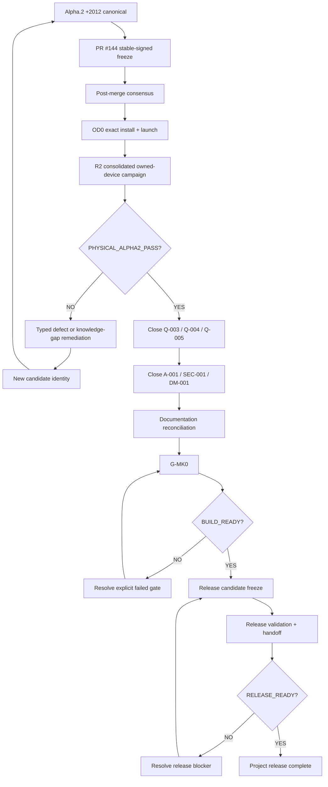

# FinanceSensor / PocketFinances — Action, Execution and Implementation Plan

**Plan authority:** closure roadmap for `jett/mk0-foundation`  
**Status:** ACTIVE  
**Planning date:** 2026-09-15  
**Rule:** no gate is closed by prose. Every closure requires repository evidence and the exact candidate identity to which the evidence applies.

## 1. Objective

Move FinanceSensor from the current Alpha.2 `+2012` certification frontier to a correctly documented, reproducible and releasable product without weakening the existing fail-closed model.

The plan intentionally separates:

1. product/runtime implementation;
2. deterministic automated evidence;
3. trusted-edge/private evidence;
4. owned-device physical evidence;
5. project governance/documentation;
6. build readiness;
7. release readiness.

A green CI run alone is not project completion.

## 2. Current starting point

Current candidate:

```text
0.2.0-alpha.2+2012
```

Frozen unsigned APK:

```text
SHA-256 74e690e9858fd0ef72d0e39f0863371fa1f1f9cfa726a5078e237d33439c587e
bytes   182538547
```

Current release claims:

```text
PHYSICAL_ALPHA2_PASS=NO
BUILD_READY=NO
RELEASE_READY=NO
```

PR #144 is the current signed-candidate/OD0 transition and must be resolved before the physical campaign can be considered authoritative on the base branch.

## 3. Closure graph



## 4. Workstream A — protect the current authority chain

### A0.1 Freeze semantics

- Preserve the exact canonical `+2012` source/APK identity.
- Do not inherit any physical PASS from `+2009`, `+2011` or older candidates.
- Do not alter parser/runtime source while the `+2012` physical campaign is active.
- Documentation-only changes must not be interpreted as a new product candidate.

**Exit:** candidate identity and applicable evidence are unambiguous.

### A0.2 Resolve PR #144

- Require all configured PR checks to pass.
- Review the ledger transition and signed APK receipt.
- Merge only if the proposed stable identity matches the exact canonical unsigned input.
- Run the required post-merge consensus/readiness checks.
- Persist the resulting merge/run identifiers in the certification ledger/status docs.

**Exit:** stable-signed `+2012` identity is authoritative on the base branch and OD0 is legally reachable under project governance.

## 5. Workstream B — physical Alpha.2 certification

### B1. OD0 — exact install and launch

Use only the repository-approved OD0 harness and exact frozen signed APK.

Required evidence:

- expected signed SHA-256;
- expected byte length;
- expected signer;
- exactly one authorized owned Android device;
- correct `versionCode=2012`;
- `adb install -r` path only;
- successful package resolution/launch;
- sanitized receipt only.

Forbidden evidence:

- raw Gmail content;
- statement plaintext;
- PDF password;
- OAuth tokens;
- keystore/private key;
- device serial or unnecessary personal identifiers.

**Exit:** OD0 PASS bound to the exact signed `+2012` identity.

### B2. Consolidated R2 campaign

Execute the finite owned-device campaign defined by the repository. The campaign must prove the intended user journey rather than merely app launch.

Minimum closure dimensions:

- Gmail authorization/connectivity boundary;
- safe source discovery;
- attachment acquisition for eligible profiles;
- session-only password behavior;
- statement open/decode path;
- strict parser behavior;
- persistence/runtime materialization;
- financial dashboard materialization;
- failure isolation: one bad/unsupported EECC does not destroy already-safe evidence;
- disconnect/secret cleanup behavior;
- no raw exception leakage.

For each physical gate:

```text
PASS         -> advance
FAIL         -> type defect, create new candidate if source changes, reset non-inheritable evidence
INCONCLUSIVE -> repeat only when evidence/environment is genuinely ambiguous
```

**Exit:** `PHYSICAL_ALPHA2_PASS=YES` only after every required physical acceptance criterion is satisfied by the exact signed candidate.

## 6. Workstream C — remaining MK0 exit gates

After physical Alpha.2 PASS, close the existing project gates in the repository-defined order:

```text
Q-003
Q-004
Q-005
  ↓
A-001
SEC-001
DM-001
  ↓
G-MK0
  ↓
BUILD_READY
```

This plan intentionally does not invent names or acceptance semantics for these gate IDs. Their repository definitions are authoritative. For each gate:

1. locate the canonical requirement/validator;
2. list required evidence;
3. execute the validator/test;
4. persist a machine-readable receipt where the repository pattern requires one;
5. record PASS/FAIL and exact SHA/run;
6. never close a dependent gate while a prerequisite remains open.

**Exit:** every MK0 exit node is closed and `BUILD_READY=YES` is mechanically justified.

## 7. Workstream D — documentation closure

Documentation must be regenerated/reconciled from the actual repository state, not from an aspirational plan.

Required closure set:

- `docs/closure/PROJECT_STATUS_2026-09-15.md` — evidence snapshot.
- `docs/closure/EXECUTION_PLAN.md` — this plan.
- `docs/closure/DEFINITION_OF_DONE.md` — completion contract.
- `docs/closure/AUDIT_RECONCILIATION.md` — generic audit vs. repository evidence.
- architecture overview and trust boundaries.
- data model / canonical financial evidence model.
- Gmail/OAuth boundary and scopes.
- statement-profile/parser registry and supported/unsupported matrix.
- secrets/privacy policy.
- CI/CD and runner governance.
- trusted-edge signing runbook.
- owned-device certification runbook.
- release runbook.
- known limitations.
- troubleshooting guide using safe diagnostic codes.
- user-facing installation/onboarding guide.
- changelog/release notes for the release candidate.
- final evidence manifest linking requirements -> tests/gates -> receipts.

### Documentation acceptance rule

Every statement must be classifiable as one of:

- **PROVEN** — backed by current evidence;
- **PLANNED** — explicitly future work;
- **OUT_OF_SCOPE** — intentionally excluded;
- **UNVERIFIED** — cannot currently be claimed.

No documentation may silently convert PLANNED or UNVERIFIED into PROVEN.

## 8. Workstream E — product readiness after MK0

Once `BUILD_READY=YES`, prepare a frozen release candidate. The release candidate must not add opportunistic features.

Required tasks:

- freeze the exact source and distributable identity;
- run full automated regression on the exact release SHA;
- reproduce the distributable from the documented build path;
- verify signing identity and install/upgrade path;
- validate persistence compatibility/idempotency/replay expectations;
- execute the final bounded owned-device smoke/UAT required by release policy;
- confirm privacy/secrets boundaries;
- finalize user documentation and release notes;
- record known limitations as explicit product constraints;
- create release evidence manifest.

**Exit:** release candidate satisfies the `RELEASE_READY` contract.

## 9. Workstream F — release and project closure

A release is complete only when all of the following coexist:

- exact source SHA frozen;
- exact signed distributable hash frozen;
- automated gates green on that source;
- required physical gates PASS on that distributable;
- no open P0/P1 release-blocking defect;
- final documentation matches the shipped product;
- install/upgrade/rollback instructions exist;
- evidence manifest is complete;
- `BUILD_READY=YES`;
- `RELEASE_READY=YES`;
- release tag/release notes identify the exact authority chain.

After this point, unresolved enhancements move to the next milestone and do not retroactively keep the completed release open.

## 10. Priority order

### P0 — blocks completion

1. Resolve PR #144 + post-merge consensus.
2. OD0 on exact signed `+2012`.
3. Complete R2 owned-device campaign.
4. Close any defect discovered by R2 under candidate-invalidation law.
5. Reach `PHYSICAL_ALPHA2_PASS=YES`.
6. Close Q-003/Q-004/Q-005.
7. Close A-001/SEC-001/DM-001.
8. Close G-MK0 and obtain `BUILD_READY=YES`.
9. Freeze and certify release candidate.
10. Obtain `RELEASE_READY=YES` and publish the exact release evidence.

### P1 — required documentation/productization

- architecture/trust-boundary consolidation;
- supported-bank/profile matrix;
- data model and persistence docs;
- user/install/troubleshooting docs;
- release/signing/certification runbooks;
- final requirement-to-evidence traceability;
- explicit known limitations.

### P2 — after the first completed release

- additional bank/profile coverage beyond the currently proven set;
- unsupported-platform expansion such as iOS unless promoted into a separately planned milestone;
- UX polish not required by release acceptance;
- new analytics/insights features;
- broader automation of trusted-edge steps where doing so does not weaken the privacy model.

## 11. Execution discipline

For every task use this closure loop:

```text
Requirement
  -> evidence needed
  -> implementation/change (only if required)
  -> automated validation
  -> physical validation when applicable
  -> durable receipt
  -> documentation update
  -> gate closure
```

If a task cannot name its required evidence and exit condition, it is not ready to execute.

## 12. Immediate next action

The immediate controlling action is **not new feature development**. It is:

```text
PR #144
  -> merge/readiness consensus
  -> exact signed +2012 OD0
  -> consolidated R2 campaign
```

Only evidence produced by that chain determines whether the next action is gate closure or a new candidate remediation.
