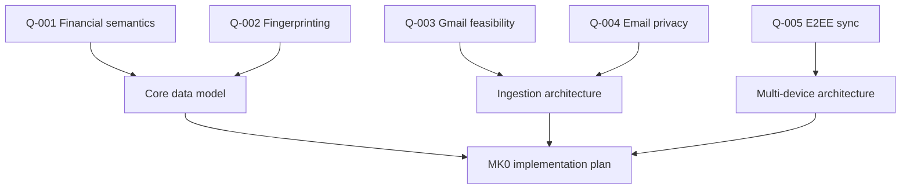

# MK0 / 02 — Quarries

A quarry is a bounded research problem that must terminate in an actionable conclusion.

## Contract

Every quarry closes with:

```text
QUESTION
   ↓
EVIDENCE
   ↓
FINDING
   ↓
IMPLICATION
   ↓
DECISION / ADR / REQUIREMENT / INVARIANT
   ↓
CLOSED
```

A link collection is not a closed quarry.

## Active quarry graph

| ID | Quarry | Priority | Status | Downstream dependency |
|---|---|---:|---|---|
| Q-001 | Canonical transaction semantics | P0 | OPEN | Data model, resolver, analytics |
| Q-002 | Transaction fingerprinting / dedup / idempotency | P0 | OPEN | Resolver, sync, ledger correctness |
| Q-003 | Gmail OAuth / API / policy feasibility | P0 | OPEN | MK0 ingestion |
| Q-004 | Email privacy / data minimization | P0 | OPEN | Architecture, threat model, onboarding |
| Q-005 | Local-first E2EE synchronization | P0 | OPEN | Multi-device architecture |
| Q-006 | Sustainable monetization | P0 | OPEN | Product thesis / later go-to-market |
| Q-007 | Human financial language | P1 | OPEN | Design / copy / Sensor intelligence |
| Q-008 | Recurring-event detection | P1 | OPEN | MK0 recurring foundation, MK1 intelligence |
| Q-009 | Household / membership model | P1 | OPEN | Tenancy model |
| Q-010 | LatAm PFM / Open Finance landscape | P1 | OPEN | Connector roadmap / localization |
| Q-011 | Savings opportunity intelligence | P1 | OPEN | MK1 opportunity engine |
| Q-012 | Regional connectivity strategy | P1 | OPEN | Multi-source roadmap |

## Critical path



`BUILD_READY` is blocked while any P0 quarry required by MK0 remains unresolved.

## Quarry files

- [`Q-001-CANONICAL-TRANSACTIONS.md`](Q-001-CANONICAL-TRANSACTIONS.md)
- [`Q-002-FINGERPRINTING.md`](Q-002-FINGERPRINTING.md)
- [`Q-003-GMAIL-POLICY.md`](Q-003-GMAIL-POLICY.md)
- [`Q-004-EMAIL-PRIVACY.md`](Q-004-EMAIL-PRIVACY.md)
- [`Q-005-LOCAL-FIRST-SYNC.md`](Q-005-LOCAL-FIRST-SYNC.md)
- [`Q-006-MONETIZATION.md`](Q-006-MONETIZATION.md)
- [`Q-007-HUMAN-LANGUAGE.md`](Q-007-HUMAN-LANGUAGE.md)
- [`Q-008-RECURRING-ENGINE.md`](Q-008-RECURRING-ENGINE.md)
- [`Q-009-HOUSEHOLD.md`](Q-009-HOUSEHOLD.md)
- [`Q-010-LATAM-PFM.md`](Q-010-LATAM-PFM.md)
- [`Q-011-SAVINGS-INTELLIGENCE.md`](Q-011-SAVINGS-INTELLIGENCE.md)
- [`Q-012-REGIONAL-CONNECTIVITY.md`](Q-012-REGIONAL-CONNECTIVITY.md)
