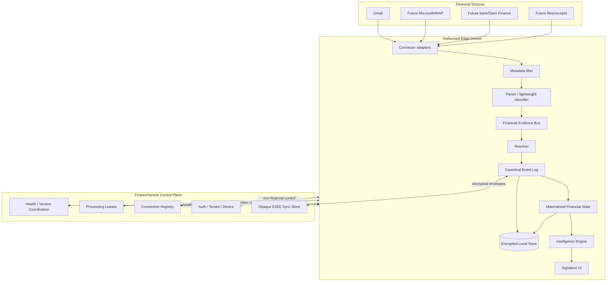

# MK0 / 04 — Core Architecture

## Architecture thesis

FinanceSensor is a distributed, privacy-first financial telemetry system.

```text
Cloud coordinates.
Devices observe and reason.
Tenant owns financial truth.
```

## Three planes

### 1. Control Plane — cloud

Responsibilities:

- authentication;
- tenant registry;
- membership registry;
- device registry;
- connection registry;
- device/connection health;
- work scheduling / leases;
- schema/rules version coordination;
- push notification coordination;
- opaque encrypted event/state synchronization.

The control plane should not require plaintext merchant, amount, category, email body or attachment data for these duties.

### 2. Data Plane — edge device

Responsibilities:

- connect directly to permitted financial sources;
- incremental source ingestion;
- metadata filtering;
- deterministic parsers;
- lightweight classification;
- optional local ML/OCR;
- evidence extraction;
- transaction resolution;
- canonical event log;
- encrypted local persistence;
- local materialized state.

### 3. Intelligence Plane — primarily edge

Responsibilities:

- categorization;
- merchant normalization;
- recurring detection;
- anomaly detection;
- financial trends;
- opportunity generation;
- explanation generation;
- forecast labeling and confidence.

## System diagram



## Connector architecture

Provider-specific behavior must terminate at adapters.

```text
FinancialSource
├── MailSource
│   ├── GmailAdapter
│   ├── MicrosoftAdapter
│   └── IMAPAdapter
├── BankAggregatorSource
├── DirectBankSource
├── StatementImportSource
└── ReceiptImportSource
```

Adapters emit `SourceArtifact` / `FinancialEvidence` into a common pipeline. Gmail-specific IDs must not become canonical domain IDs.

## Ingestion ladder

The edge pipeline should minimize expensive inference:

```text
Stage 0 — metadata/envelope filtering
sender, subject, date, headers, MIME/attachment hints

Stage 1 — deterministic rules/templates
known senders/domains/templates

Stage 2 — structured parsers
provider/merchant-specific extraction

Stage 3 — lightweight local classifier/model
only when needed

Stage 4 — Needs Review
when confidence remains insufficient
```

A large on-device LLM is never required for core correctness.

## Event architecture

```text
SourceArtifact
      ↓
FinancialEvidence
      ↓
FinancialEventCandidate
      ↓
Resolution
      ↓
CanonicalFinancialEvent
      ↓
MaterializedFinancialState
```

The event log is the authority. Materialized state is rebuildable.

## Multi-device execution

Connections belong to Tenant. A device may temporarily execute a connection.

```text
Connection
   ↓ claim
ProcessingLease
   ↓
Device executor
```

Lease failure does not compromise correctness because ingestion/resolution must remain idempotent.

## E2EE synchronization target

```text
Device A
  ↓ local canonical event
  ↓ encrypt
Opaque cloud envelope store
  ↓
Device B
  ↓ decrypt
  ↓ deterministic replay
Convergent financial state
```

Exact cryptography remains blocked on Q-005 and a security ADR.

## Background execution

The product optimizes for **eventual freshness**, not fake real-time.

Android is the first target and should use platform-appropriate scheduled/background work rather than persistent polling where possible.

The architecture must remain compatible with iOS's more restrictive background execution later.

## Device capability strategy

Core mode:

- parsers;
- rules;
- lightweight classification;
- encrypted ledger;
- categories;
- recurring foundation;
- analytics.

Accelerated mode on capable hardware may add:

- richer local semantic classification;
- OCR acceleration;
- local language generation;
- more advanced merchant inference.

Capabilities affect automation level, not financial truth guarantees.

## Failure philosophy

When the device cannot confidently resolve evidence:

```text
unknown
  ↓
Needs Review
```

Never:

```text
unknown
  ↓
guess
  ↓
wrong ledger
```

## Architecture gates

Architecture is not frozen until:

- Q-001 semantics closes;
- Q-002 fingerprinting closes;
- Q-003 Gmail feasibility closes;
- Q-004 privacy boundary closes;
- Q-005 sync/key model closes;
- data model and signature wireframes are mutually traced;
- low-end Android feasibility spike passes.
