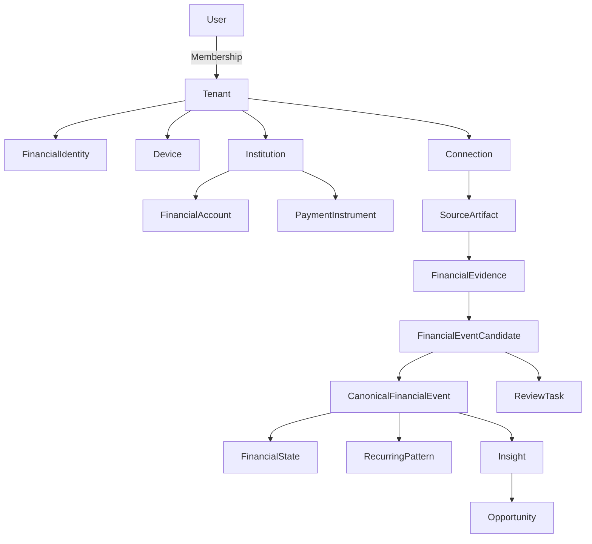

# DM-001 — FinanceSensor Core Data Model

**Status:** DRAFT / requires Q-001, Q-002 and Q-005 closure before freeze.

The model is deliberately separated into **conceptual**, **logical** and **physical-contract** layers. We do not commit to a specific database engine here.

## 1. Conceptual model



## 2. Ownership backbone

### User

Authentication identity for the product.

Candidate fields:

```text
id
status
created_at
updated_at
```

PII/profile fields should remain outside domain tables where practical.

### Tenant

Financial ownership/isolation boundary.

```text
id
type              PERSONAL | HOUSEHOLD | BUSINESS_FUTURE
status
base_currency?    optional preference, never erases source currency
created_at
updated_at
```

### Membership

```text
id
tenant_id
user_id
role
status
joined_at
revoked_at?
```

MK0 may only use an owner membership but must not encode `tenant_id == user_id`.

### FinancialIdentity

Represents a person/actor inside a financial tenant.

```text
id
tenant_id
display_name?      optional local/user-facing label
status
created_at
```

## 3. Edge model

### Device

```text
id
tenant_id?        association may be through authorization table if device spans tenants
user_id
platform          ANDROID | IOS | OTHER_FUTURE
app_version
schema_version
status            ACTIVE | REVOKED | STALE
last_seen_at
created_at
revoked_at?
```

If one device supports several tenants, use `DeviceTenantAuthorization` rather than duplicating Device.

### DeviceCapability

```text
device_id
capability
value/version
observed_at
```

Examples:

```text
LOCAL_ML
OCR
SECURE_HARDWARE
BACKGROUND_WORK
BIOMETRIC_LOCK
```

### DeviceKey

Only metadata/public-key material belongs in ordinary model descriptions.

```text
id
device_id
key_type
public_key
status
created_at
revoked_at?
```

Private key material must never be stored in normal application tables/cloud plaintext.

## 4. Connectivity model

### Connection

Tenant-owned source authorization/configuration.

```text
id
tenant_id
source_type       GMAIL | MICROSOFT | IMAP | BANK_AGGREGATOR | IMPORT | ...
provider
remote_identity_opaque
status            ACTIVE | NEEDS_AUTH | PAUSED | REVOKED | ERROR
created_at
last_success_at?
```

`remote_identity_opaque` must avoid unnecessary plaintext personal identifiers in the cloud control plane.

### ConnectionCredentialRef

Reference/handle to secure token storage rather than credentials in the main database.

```text
connection_id
credential_ref
scope_set_hash
updated_at
```

### ConnectionCursor

```text
connection_id
cursor_type
cursor_value_encrypted_or_opaque
updated_at
```

### ProcessingLease

```text
id
connection_id
device_id
lease_epoch
claimed_at
expires_at
released_at?
```

A lease reduces duplicate work but is never relied on for correctness.

## 5. Financial institution model

### Institution

```text
id
tenant_id
canonical_name
country?
institution_type
external_refs[]
```

### FinancialAccount

```text
id
tenant_id
institution_id?
financial_identity_id?
account_type       CHECKING | SAVINGS | CREDIT | WALLET | CASH | OTHER
currency
masked_identifier?
ownership_type     INDIVIDUAL | JOINT | UNKNOWN
status
```

### PaymentInstrument

```text
id
tenant_id
institution_id?
financial_account_id?
financial_identity_id?
instrument_type    CREDIT_CARD | DEBIT_CARD | OTHER
network?
masked_identifier?
status
```

### Merchant

Canonical counterparty identity.

```text
id
tenant_id?        decide whether canonical catalog can be global + tenant alias layer
canonical_name
merchant_type?
```

### MerchantAlias

```text
id
merchant_id
raw_pattern
source_type?
confidence
created_by        SYSTEM | USER
```

### Category

```text
id
tenant_id?        system categories + tenant customization may be layered
parent_id?
name
status
```

## 6. Source and evidence model

### SourceArtifact

Identity/metadata for raw input.

```text
id
tenant_id
connection_id?
origin_device_id
source_type
source_native_id?
source_native_version?
content_hash
observed_at
source_created_at?
retention_state
parser_eligibility_state
```

Raw body/attachment content is not assumed to persist in this record.

### FinancialEvidence

Minimal structured fact extracted from a SourceArtifact.

```text
id
tenant_id
source_artifact_id
extractor_type
extractor_version
observed_at
occurred_at?
amount?
currency?
merchant_raw?
merchant_candidate_id?
account_hint?
instrument_hint?
external_reference?
evidence_type
confidence
payload_encrypted_local
```

The exact sensitive-field split between indexed columns and encrypted payload must be determined by threat model and local storage design.

### EvidenceLink

Represents evidence-to-evidence relationships discovered before canonical resolution.

```text
id
left_evidence_id
right_evidence_id
relation_type
score
resolver_version
```

## 7. Candidate and canonical event model

### FinancialEventCandidate

```text
id
tenant_id
candidate_type
amount
currency
occurred_at?
merchant_candidate_id?
financial_account_id?
payment_instrument_id?
confidence
resolution_state    DETECTED | PROBABLE | CONFIRMED | REJECTED | MERGED | REVIEW
fingerprint_version
fingerprint_value
created_at
updated_at
```

### CandidateEvidence

Many-to-many linkage:

```text
candidate_id
evidence_id
role
weight?
```

### CanonicalFinancialEvent

Append-only economic event authority.

```text
id
tenant_id
event_type
amount
currency
occurred_at
posted_at?
financial_account_id?
payment_instrument_id?
merchant_id?
category_id?
confidence_state     HIGH | MEDIUM | USER_CONFIRMED
canonical_status     ACTIVE | REVERSED | SUPERSEDED
created_from_resolver_version
created_at
```

Candidate event types for Q-001:

```text
INCOME
EXPENSE
TRANSFER_INTERNAL
TRANSFER_EXTERNAL_IN
TRANSFER_EXTERNAL_OUT
CARD_PAYMENT
REFUND
REVERSAL
FEE
```

### CanonicalEventEvidence

```text
canonical_event_id
evidence_id
relation_type
```

### FinancialEventRelation

For semantic relationships:

```text
id
from_event_id
to_event_id
relation_type
```

Examples:

```text
REFUNDS
REVERSES
SETTLES
TRANSFER_COUNTERPART
SUPERSEDES
```

## 8. Event/action log

Changes should be representable as durable actions/events rather than destructive mutation where auditability matters.

### SyncEvent / DomainActionEnvelope

Candidate routing fields:

```text
event_id
tenant_id
origin_device_id
device_sequence
event_kind
schema_version
created_at
ciphertext
ciphertext_hash
```

Payload examples:

```text
CANONICAL_EVENT_CREATED
CATEGORY_CORRECTED
MERCHANT_CORRECTED
CANDIDATE_REJECTED
REVIEW_RESOLVED
RECURRING_PATTERN_CONFIRMED
DEVICE_AUTHORIZATION_CHANGED
```

The exact event-sourcing boundary remains to be frozen. We do not need to event-source every ephemeral UI state.

## 9. Recurring model

### RecurringPattern

```text
id
tenant_id
merchant_id?
category_id?
financial_account_id?
payment_instrument_id?
pattern_type
cadence
expected_amount_model
currency
next_expected_window?
confidence
state        CANDIDATE | ACTIVE | DISMISSED | ENDED
created_at
updated_at
```

### RecurringOccurrence

```text
pattern_id
canonical_event_id
match_score
```

## 10. Intelligence model

### Insight

```text
id
tenant_id
insight_type
severity       INFO | CHANGE | REVIEW | IMPORTANT
fact_window
created_at
expires_at?
state          ACTIVE | ACKNOWLEDGED | DISMISSED | RESOLVED
explanation_key
```

### InsightEvidence

```text
insight_id
canonical_event_id?
recurring_pattern_id?
evidence_id?
role
```

### Opportunity

```text
id
tenant_id
insight_id
opportunity_type
estimated_amount?
estimated_currency?
estimation_period?
projection_flag
state          ACTIVE | ACCEPTED | DISMISSED | RESOLVED
```

### ReviewTask

```text
id
tenant_id
subject_type
subject_id
reason
priority
state          OPEN | RESOLVED | DISMISSED
created_at
resolved_at?
resolved_by_user_id?
```

## 11. Materialized financial state

The UI should not recompute the ledger from raw email on every open.

Candidate read models:

```text
PeriodSummary
CategorySummary
RecurringSummary
UpcomingSummary
SensorSummary
MovementTimeline
```

These are **derived/materialized** and rebuildable from canonical state plus approved user actions.

## 12. Currency rule

Never destroy source currency.

A converted display value, when introduced, must retain:

```text
source_amount
source_currency
converted_amount
converted_currency
fx_rate
fx_rate_source
fx_rate_time
```

MK0 can avoid cross-currency aggregation until this is correctly specified.

## 13. Time rule

Do not collapse all timestamps into one ambiguous `date`.

Where relevant distinguish:

```text
source_created_at
observed_at
occurred_at
authorized_at
posted_at
resolved_at
```

## 14. Delete vs audit

Raw source content may be aggressively minimized/deleted while financial derived state may persist because the user expects historical financial memory. Account/tenant deletion must still have an explicit full lifecycle.

## 15. Physical model gates

Before physical schema freeze:

```text
TENANCY_MODEL            PASS
Q-001 SEMANTICS          CLOSED
Q-002 FINGERPRINTING     CLOSED
Q-005 SYNC MODEL         CLOSED
THREAT MODEL             PASS
INDEX / QUERY MODEL      PASS
MIGRATION STRATEGY       PASS
ERD REVIEW               PASS
```

Do not turn this draft directly into migrations until those gates close.
