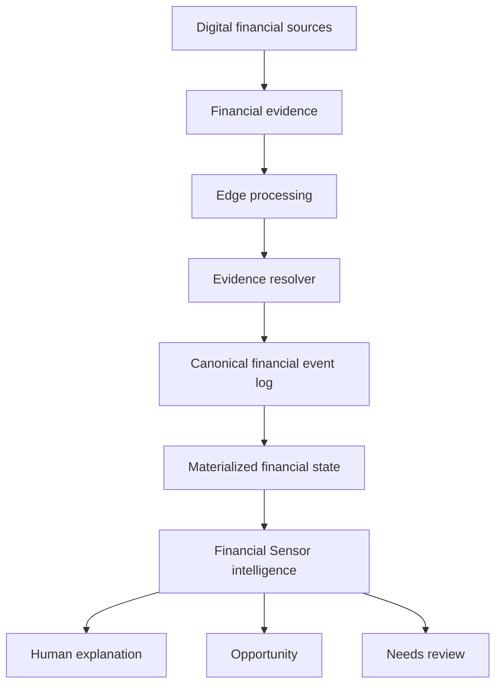

# PRODUCT THESIS — FinanceSensor

## 1. Definition

FinanceSensor is a **privacy-first financial intelligence system** that observes digital evidence generated by a user's financial life, resolves that evidence into trustworthy financial events, and translates the resulting state into simple explanations, alerts and opportunities.

A useful internal analogy is **OBD-II for finances**:

| Auto telemetry | FinanceSensor |
|---|---|
| Vehicle | Financial tenant |
| OBD-II | Financial connectors |
| ECU / sensors | Email, banks, receipts, files |
| PID | Financial evidence |
| Telemetry | Financial events |
| DTC | Financial anomaly |
| Vehicle state | Financial state |
| Mobile device | Edge node |
| Backend | Control plane |

## 2. What it is not

FinanceSensor is not primarily:

- an accounting product;
- a manual expense tracker;
- a banking app;
- a generic email parser;
- a chatbot with financial prompts;
- a dashboard that requires financial expertise.

The email inbox is the **first sensor**, not the product boundary.

## 3. Product promise

The intended user experience is:

```text
Connect.
Live normally.
Understand.
```

The user should not need to spend every evening entering expenses, maintaining spreadsheets, or interpreting accounting vocabulary.

## 4. Core pipeline



## 5. The central distinction

**Evidence is not a transaction.**

A single purchase can generate:

- a bank purchase notification;
- a merchant receipt;
- an electronic invoice;
- a delivery confirmation.

Those are multiple pieces of evidence that may resolve to one canonical transaction.

```text
N pieces of evidence
        ↓
resolution
        ↓
1 canonical financial event
```

This distinction protects FinanceSensor against duplicate counting and makes provenance possible.

## 6. Human product language

Internally the system may reason about cash inflow, variance, confidence scores, reconciliation state and recurring-event probability.

The user sees:

- Entró dinero.
- Gastaste.
- Moviste dinero.
- Te devolvieron dinero.
- Se repite.
- Cambió.
- Hay algo por revisar.
- Encontramos una oportunidad.

**Internally we speak finance. Externally we speak money.**

## 7. Non-judgmental intelligence

FinanceSensor must describe patterns without evaluating the user's lifestyle.

Bad:

> Gastas demasiado en delivery.

Good:

> Delivery está S/75 por encima de tu nivel habitual este mes.

The second statement is evidence-based and gives the user control.

## 8. Actionable value grammar

An insight should normally follow:

```text
OBSERVATION
     ↓
CONTEXT
     ↓
MONEY IMPACT
     ↓
OPTION
```

Example:

> Spotify pasó de S/18.90 a S/20.90. Son aproximadamente S/24 adicionales al año. Revisar.

## 9. Privacy thesis

The default architecture is:

```text
Provider
   ↓ direct encrypted connection
Device
   ↓ local extraction / classification / resolution
Encrypted local ledger
   ↓ E2EE opaque synchronization
Cloud control plane
```

The cloud coordinates identities, tenants, devices, connection health, scheduling, schema versions and encrypted synchronization. It should not need plaintext email bodies or plaintext financial ledgers to perform those duties.

## 10. Multi-device and multi-source by design

A customer may have:

- multiple devices;
- multiple email accounts;
- multiple banks;
- multiple financial accounts;
- multiple payment cards;
- multiple financial identities;
- multiple tenants over time.

Therefore:

```text
Tenant != User
Tenant != Device
Tenant != Email account
Tenant != Bank
```

A tenant is an isolated financial universe.

## 11. Product north star

Opening FinanceSensor should answer three questions in seconds:

1. **What happened?**
2. **What changed?**
3. **What matters now?**

The product succeeds when the user understands those answers without needing to become a finance expert.
